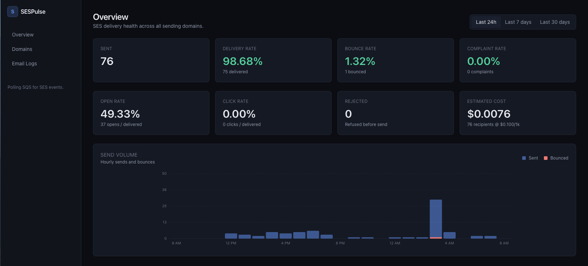

# SESPulse

Self-hosted dashboard for **Amazon SES**: delivery health at a glance,
per-domain breakdowns, and a searchable log of every message with its full
event timeline. Dark mode by default.

[](LICENSE)




```
SES  ──►  SNS topic  ──►  SQS queue  ──►  worker  ──►  Postgres  ──►  SESPulse
        (event publishing)              (polling)
```

## Why

If you send mail through SES, the only built-in way to see what's happening
is CloudWatch metrics (aggregate, no per-message detail) or digging through
raw SNS/Firehose logs. SESPulse keeps a local Postgres copy of every event,
so you can answer questions like:

- What's my bounce rate on `transactional.acme.com` in the last 24h?
- Did the welcome email to `someone@example.com` actually arrive?
- Why did it bounce — was it a hard bounce or a transient mailbox-full?

…without leaving the dashboard.

## Features

- **Overview** — sends, delivery rate, bounce rate, complaint rate, open
  rate, click rate, plus an estimated cost for the selected range
  (default $0.10 per 1,000 recipients, configurable). Rate cards are tinted
  against [SES reputation limits](https://docs.aws.amazon.com/ses/latest/dg/reputationdashboard-faqs.html).
  Includes a time-series chart of sends and bounces (hourly for 24h, daily for 7d/30d)
- **Per-domain breakdown** — same metrics grouped by sending domain
- **Email logs** — filter by sending domain, event type, or free-text
  (subject / from / recipient); drill into any message to see its event
  timeline with bounce diagnostics, open/click IPs, and the raw payload
- **All SES event types** — Send, Delivery, Bounce, Complaint, Open,
  Click, Reject, RenderingFailure, DeliveryDelay
- **At-least-once ingestion** — deduplicates by SNS `MessageId`, survives
  worker restarts
- **Live updates** — the UI refetches every 30 seconds while the tab is open (paused when backgrounded), so you can leave the dashboard up during an incident
- **Health check endpoint** — `GET /api/health` returns `200 / "ok"` (or `503 / "error"`) with a database ping latency, for plugging into UptimeRobot / BetterStack / Cronitor / etc.
- **One-command deploy** — `docker compose up -d --build`

## Architecture: why SQS instead of a webhook?

SES can publish events to SNS, and SNS can deliver them either by HTTPS
webhook or by pushing into an SQS queue. SESPulse uses the **SQS pull
model** on purpose:

| | Webhook (SNS → HTTPS) | Queue (SNS → SQS → poll) |
|---|---|---|
| Public endpoint required | Yes (with TLS) | No |
| Buffers events on outage | No (SNS retries, then DLQ) | Yes |
| Subscription confirmation handling | You must implement it | None needed |
| Dedupe across retries | Manual | Built-in via `MessageId` |

SESPulse can sit on a private network, behind a VPN, or on your homelab
with no inbound ports open.

## Quick start

### 1. AWS side (one-time)

```sh
# 1. Topic + queue
aws sns create-topic --name ses-events
aws sqs create-queue --queue-name ses-events

# 2. Subscribe the queue to the topic
aws sns subscribe \
  --topic-arn <topic-arn> \
  --protocol sqs \
  --notification-endpoint <queue-arn>
```

Attach this policy to the queue so SNS can deliver to it:

```json
{
  "Version": "2012-10-17",
  "Statement": [{
    "Effect": "Allow",
    "Principal": { "Service": "sns.amazonaws.com" },
    "Action": "sqs:SendMessage",
    "Resource": "<queue-arn>",
    "Condition": { "ArnEquals": { "aws:SourceArn": "<topic-arn>" } }
  }]
}
```

In the **SES console**: *Configuration sets → Create → Event destinations →
Add destination → Amazon SNS → pick the topic*. Enable the event types you
want (at minimum `send, delivery, bounce, complaint`; add `open, click,
reject, renderingFailure, deliveryDelay` to light up every panel).

Then either set the config set as default on your verified identity, or
pass `ConfigurationSetName` per `SendEmail` call.

Create an IAM user (or role) for SESPulse with **only** these permissions
on the queue:

```json
{
  "Version": "2012-10-17",
  "Statement": [{
    "Effect": "Allow",
    "Action": [
      "sqs:ReceiveMessage",
      "sqs:DeleteMessage",
      "sqs:GetQueueAttributes"
    ],
    "Resource": "<queue-arn>"
  }]
}
```

### 2. Run SESPulse

```sh
git clone https://github.com/venelinkochev/sespulse
cd sespulse
cp .env.example .env
# Fill in AWS_REGION, AWS_ACCESS_KEY_ID, AWS_SECRET_ACCESS_KEY, SES_EVENTS_QUEUE_URL
docker compose up -d --build
```

Open <http://localhost:3000>. The first events should show up within a
minute of sending an email through the configured set.

`docker compose` brings up:

- `db` — Postgres 16, data persisted in the `ses_db` volume
- `migrate` — one-shot, creates the schema
- `web` — Next.js dashboard on port 3000
- `worker` — long-polls SQS and writes events to Postgres

## Local development

```sh
npm install
docker compose up -d db          # just Postgres
export $(grep -v '^#' .env | xargs)
npm run db:migrate
npm run worker:dev &             # background — polls your SQS queue
npm run dev                      # http://localhost:3000
```

## Configuration

All config is environment variables — see [`.env.example`](.env.example):

| Variable | Required | Description |
|---|---|---|
| `DATABASE_URL` | yes | Postgres connection string |
| `AWS_REGION` | yes | Region of your SES + SQS |
| `AWS_ACCESS_KEY_ID` | yes¹ | IAM credentials for SQS access |
| `AWS_SECRET_ACCESS_KEY` | yes¹ | IAM credentials for SQS access |
| `SES_EVENTS_QUEUE_URL` | yes | URL of the SQS queue receiving SES events |
| `SES_PRICE_PER_1000` | no | USD per 1,000 recipients for the cost estimate (default `0.10`) |
| `DASHBOARD_USER` | no | If set with `DASHBOARD_PASSWORD`, the dashboard requires sign-in via a login page |
| `DASHBOARD_PASSWORD` | no | Paired with `DASHBOARD_USER` |
| `SESSION_SECRET` | no | HMAC secret for the session cookie. Falls back to `DASHBOARD_PASSWORD`; set to a long random string in production |
| `DASHBOARD_REFRESH_SECONDS` | no | Auto-refresh interval for Overview and Domains pages (default `60`, set to `0` to disable). Email Logs never auto-refresh |

¹ Not required if SESPulse runs in AWS with an attached IAM role (EC2,
ECS, EKS) — the SDK will pick up role credentials automatically.

## Health check

`GET /api/health` is a public endpoint (no auth required) that pings the
database and reports overall service health. Point your uptime monitor at it:

```sh
curl https://your-host/api/health
```

```json
{
  "status": "ok",
  "checks": {
    "database": { "ok": true, "latencyMs": 4 }
  },
  "timestamp": "2026-05-14T11:22:33.000Z"
}
```

Returns `200` when healthy and `503` when the database ping fails — most
monitoring tools (UptimeRobot, BetterStack, Cronitor, Pingdom) will alert
on the status code automatically.

## Upgrading

To pull the latest changes and rebuild:

```sh
cd /path/to/sespulse
git pull
docker compose up -d --build
```

The `migrate` service runs on startup and applies any new schema changes
automatically. To watch the new containers start:

```sh
docker compose logs -f
```

If you've only changed environment variables in `.env` (no code changes),
recreate the affected containers without a rebuild:

```sh
docker compose up -d
```

If something breaks and you want a clean rebuild from scratch:

```sh
docker compose down
docker compose up -d --build
```

This keeps the `ses_db` volume (your event history) intact. Add `-v` to
`docker compose down` only if you actually want to wipe stored events.

## Data model

- **`messages`** — one row per SES `messageId`. Holds the sender,
  recipients, subject, sending domain, and the latest event type/timestamp
  (so the logs page is fast).
- **`events`** — one row per SNS notification. Stores the event type,
  timestamp, bounce/complaint diagnostics, IP/UA for opens & clicks, and
  the full raw payload as `jsonb`. Unique on SNS `MessageId` so retries
  don't create duplicates.

Both tables are defined in [`src/db/schema.ts`](src/db/schema.ts) and the
DDL lives in [`src/db/migrate.ts`](src/db/migrate.ts).

## FAQ / gotchas

**SQS doesn't need a SubscriptionConfirmation, does it?**
Right — that's only for HTTPS subscriptions. As soon as you subscribe the
queue, SNS will start delivering. The worker still handles the confirmation
message gracefully if you somehow get one in the queue.

**What about raw message delivery?**
Supported. The worker auto-detects SNS-wrapped (`{ Type: "Notification",
Message: "<json string>" }`) vs. raw `SesNotification` payloads.

**Bounce/complaint thresholds?**
The Overview cards turn yellow/red based on
[SES's reputation thresholds](https://docs.aws.amazon.com/ses/latest/dg/reputationdashboard-faqs.html):
≥ 5% bounce rate or ≥ 0.1% complaint rate is the danger zone where SES
may pause your sending.

**How do I rotate or backfill?**
Events older than the queue's retention (default 4 days) and never seen by
the worker are gone. For backfill, point a one-off script at SES + Firehose
or replay from an S3 archive — there's no built-in importer yet.

## Roadmap

- Slack/webhook alerts when bounce or complaint rate crosses a threshold
- Per-message header view from the SES payload
- CSV export of filtered logs

PRs welcome — see [CONTRIBUTING.md](CONTRIBUTING.md).

## License

[MIT](LICENSE) © Venelin Kochev
