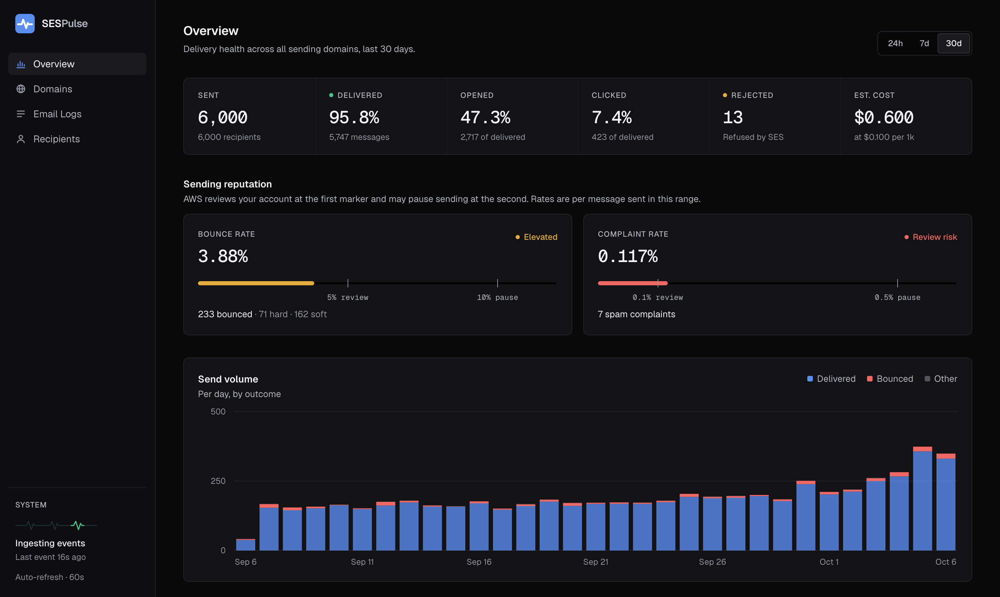

# SESPulse

Self-hosted dashboard for **Amazon SES**: delivery health at a glance,
per-domain breakdowns, per-recipient history, and a searchable log of every
message with its full event timeline. Dark mode by default.

[](LICENSE)




```
SES  ──►  SNS topic  ──►  SQS queue  ──►  worker  ──►  Postgres  ──►  SESPulse
        (event publishing)              (polling)
```

## Why

If you send mail through SES, the only built-in way to see what's happening
is CloudWatch metrics (aggregate, no per-message detail) or digging through
raw SNS/Firehose logs. SESPulse keeps a local Postgres copy of every event,
so you can answer questions like:

- What's my bounce rate on `transactional.acme.com` in the last 24h?
- Did the welcome email to `someone@example.com` actually arrive?
- Why did it bounce — was it a hard bounce or a transient mailbox-full?
- Which addresses keep bouncing or complaining, so I can stop mailing them?
- Is SESPulse itself still ingesting events, or am I looking at stale numbers?

…without leaving the dashboard.

## Features

- **Overview** — sent, delivered, opened, clicked, rejected and estimated
  cost for the selected range (default $0.10 per 1,000 recipients,
  configurable), and a chart of daily (or hourly) volume split into
  delivered, bounced and other
- **Sending reputation gauges** — bounce and complaint rates plotted
  against the [SES thresholds](https://docs.aws.amazon.com/ses/latest/dg/reputationdashboard-faqs.html)
  where AWS reviews your account (5% / 0.1%) and may pause sending
  (10% / 0.5%), so you see how close you are before AWS emails you
- **Per-domain breakdown** — the same metrics per sending domain, with
  inline bars for delivery and bounce rates
- **Email logs** — filter by sending domain, latest event type, or free-text
  (subject / from / recipient); drill into any message to see its event
  timeline with bounce diagnostics and open/click IPs
- **CSV export** — download every message matching the current log filters
  (not just the 200 on screen) for a spreadsheet, a support ticket, or
  cleaning a mailing list. See [CSV export](#csv-export)
- **Recipients** — look up any address to see every message sent to it,
  how many were delivered, bounced or complained, and the latest bounce
  diagnostic. A **Problem recipients** list shows addresses that bounced or
  complained in the selected range, with complaints and hard bounces first.
  On multi-recipient messages, deliveries, bounces and complaints are matched
  to the exact address SES reported. Every recipient in the logs and message
  pages links here.
- **Worker status** — the sidebar shows whether the SQS worker is polling
  and when it last ingested an event, and turns red if it stops. This tells
  "nobody is sending mail" apart from "the worker is down"
- **All SES event types** — Send, Delivery, Bounce, Complaint, Open,
  Click, Reject, RenderingFailure, DeliveryDelay
- **At-least-once ingestion** — deduplicates by SNS `MessageId`, survives
  worker restarts
- **Live updates** — the Overview, Domains and Problem recipients pages
  refetch every 60 seconds by default while the tab is visible, so you can
  leave the dashboard up during an incident. Logs and per-recipient pages
  don't refresh, so the page won't change while you're reading it
- **Health check endpoint** — `GET /api/health` checks both the database and
  the worker heartbeat and returns `200` or `503`, ready for UptimeRobot /
  BetterStack / Cronitor / etc.
- **One-command deploy** — `docker compose up -d --build`

## Architecture: why SQS instead of a webhook?

SES can publish events to SNS, and SNS can deliver them either by HTTPS
webhook or by pushing into an SQS queue. SESPulse uses the **SQS pull
model** on purpose:

| | Webhook (SNS → HTTPS) | Queue (SNS → SQS → poll) |
|---|---|---|
| Public endpoint required | Yes (with TLS) | No |
| Buffers events on outage | No (SNS retries, then DLQ) | Yes |
| Subscription confirmation handling | You must implement it | None needed |
| Dedupe across retries | Manual | Built-in via `MessageId` |

SESPulse can sit on a private network, behind a VPN, or on your homelab
with no inbound ports open.

## Quick start

### 1. AWS side (one-time)

```sh
# 1. Topic + queue
aws sns create-topic --name ses-events
aws sqs create-queue --queue-name ses-events

# 2. Subscribe the queue to the topic
aws sns subscribe \
  --topic-arn <topic-arn> \
  --protocol sqs \
  --notification-endpoint <queue-arn>
```

Attach this policy to the queue so SNS can deliver to it:

```json
{
  "Version": "2012-10-17",
  "Statement": [{
    "Effect": "Allow",
    "Principal": { "Service": "sns.amazonaws.com" },
    "Action": "sqs:SendMessage",
    "Resource": "<queue-arn>",
    "Condition": { "ArnEquals": { "aws:SourceArn": "<topic-arn>" } }
  }]
}
```

In the **SES console**: *Configuration sets → Create → Event destinations →
Add destination → Amazon SNS → pick the topic*. Enable the event types you
want (at minimum `send, delivery, bounce, complaint`; add `open, click,
reject, renderingFailure, deliveryDelay` to light up every panel).

Then either set the config set as default on your verified identity, or
pass `ConfigurationSetName` per `SendEmail` call.

Create an IAM user (or role) for SESPulse with **only** these permissions
on the queue:

```json
{
  "Version": "2012-10-17",
  "Statement": [{
    "Effect": "Allow",
    "Action": [
      "sqs:ReceiveMessage",
      "sqs:DeleteMessage",
      "sqs:GetQueueAttributes"
    ],
    "Resource": "<queue-arn>"
  }]
}
```

### 2. Run SESPulse

```sh
git clone https://github.com/venelinkochev/sespulse
cd sespulse
cp .env.example .env
# Fill in AWS_REGION, AWS_ACCESS_KEY_ID, AWS_SECRET_ACCESS_KEY, SES_EVENTS_QUEUE_URL
docker compose up -d --build
```

Open <http://localhost:3000>. The first events should show up within a
minute of sending an email through the configured set.

`docker compose` brings up:

- `db` — Postgres 16, data persisted in the `ses_db` volume
- `migrate` — one-shot, creates the schema
- `web` — Next.js dashboard on port 3000
- `worker` — long-polls SQS and writes events to Postgres

## Local development

```sh
npm install
docker compose up -d db          # just Postgres
export $(grep -v '^#' .env | xargs)
npm run db:migrate
npm run worker:dev &             # background — polls your SQS queue
npm run dev                      # http://localhost:3000
```

## Configuration

All config is environment variables — see [`.env.example`](.env.example):

| Variable | Required | Description |
|---|---|---|
| `DATABASE_URL` | yes | Postgres connection string |
| `AWS_REGION` | yes | Region of your SES + SQS |
| `AWS_ACCESS_KEY_ID` | yes¹ | IAM credentials for SQS access |
| `AWS_SECRET_ACCESS_KEY` | yes¹ | IAM credentials for SQS access |
| `SES_EVENTS_QUEUE_URL` | yes | URL of the SQS queue receiving SES events |
| `SES_PRICE_PER_1000` | no | USD per 1,000 recipients for the cost estimate (default `0.10`) |
| `DASHBOARD_USER` | no | If set with `DASHBOARD_PASSWORD`, the dashboard requires sign-in via a login page |
| `DASHBOARD_PASSWORD` | no | Paired with `DASHBOARD_USER` |
| `SESSION_SECRET` | no | HMAC secret for the session cookie. Falls back to `DASHBOARD_PASSWORD`; set to a long random string in production |
| `DASHBOARD_REFRESH_SECONDS` | no | Auto-refresh interval for the Overview, Domains and Problem recipients pages (default `60`, set to `0` to disable). Email logs and per-recipient pages never auto-refresh |
| `WORKER_STALE_SECONDS` | no | How long without a successful SQS poll before the worker is reported as down in the sidebar and `/api/health` (default `120`). Set to `0` to leave the worker out of `/api/health`, e.g. if you run the worker elsewhere |

¹ Not required if SESPulse runs in AWS with an attached IAM role (EC2,
ECS, EKS) — the SDK will pick up role credentials automatically.

## Health check

`GET /api/health` is a public endpoint (no auth required) that reports
overall service health. Point your uptime monitor at it:

```sh
curl https://your-host/api/health
```

```json
{
  "status": "ok",
  "checks": {
    "database": { "ok": true, "latencyMs": 4 },
    "worker": {
      "ok": true,
      "lastPollAt": "2026-05-14T11:22:21.000Z",
      "lastEventAt": "2026-05-14T11:19:02.000Z",
      "ageSeconds": 12
    }
  },
  "timestamp": "2026-05-14T11:22:33.000Z"
}
```

| Check | Fails when |
|---|---|
| `database` | Postgres doesn't answer a `SELECT 1` |
| `worker` | The worker hasn't completed an SQS poll in `WORKER_STALE_SECONDS` (default 120s), or has never run |

The worker records a heartbeat after every successful poll, including empty
ones, so a quiet period with no mail does **not** fail the check. Only a
crashed, stuck, or misconfigured worker does (bad AWS credentials, wrong
queue URL, missing SQS permissions). `lastEventAt` is for information only;
it is never used to fail the check.

Returns `200` when every check passes and `503` otherwise. Most monitoring
tools (UptimeRobot, BetterStack, Cronitor, Pingdom) alert on the status
code automatically.

## CSV export

On the **Email Logs** page, set your filters, click **Filter**, then click
**Export CSV**. The file contains every message matching the applied filters,
newest first. The page only shows the latest 200. Filters you've changed
but not applied with **Filter** aren't included.

The same export is available at `GET /api/logs/export`, with the same query
parameters as the logs page:

| Parameter | Example | Matches |
|---|---|---|
| `domain` | `mail.acme.com` | Sending domain, exact |
| `event` | `Bounce` | The message's *latest* event type (same as the dropdown) |
| `q` | `invoice` | Subject, sender, or any recipient, case-insensitive substring |

```sh
# All messages from one domain whose latest event is a bounce
curl -b "sespulse_session=…" \
  "https://your-host/api/logs/export?domain=mail.acme.com&event=Bounce" \
  -o bounces.csv
```

Like every page except `/api/health`, the endpoint requires a signed-in
session when `DASHBOARD_USER` / `DASHBOARD_PASSWORD` are set.

Columns:

| Column | Notes |
|---|---|
| `sent_at` | ISO 8601, UTC |
| `message_id` | SES message ID. Open `/logs/<message_id>` for the full timeline |
| `from_address`, `from_domain` | Sender |
| `to_addresses` | All recipients, separated by `; `. Email addresses only: display names like `"Jane Doe" <jane@x.com>` are removed |
| `subject` | |
| `status` | Latest event type: `Delivery`, `Bounce`, `Open`, … |
| `bounce_type` | `Permanent` / `Transient` / `Undetermined` when `status` is `Bounce` |
| `last_event_at` | ISO 8601, UTC |

The file is UTF-8 with a byte-order mark, so Excel shows non-ASCII subjects
and emoji correctly. Cells starting with `=`, `+`, `-` or `@` get a leading
`'` so a spreadsheet can't run them as formulas (subjects and addresses come
from outside your control). Rows are streamed in batches of 1,000, so large
exports start downloading right away without loading everything into
memory.

## Upgrading

To pull the latest changes and rebuild:

```sh
cd /path/to/sespulse
git pull
docker compose up -d --build
```

The `migrate` service runs on startup and applies any new schema changes
automatically. To watch the new containers start:

```sh
docker compose logs -f
```

If you've only changed environment variables in `.env` (no code changes),
recreate the affected containers without a rebuild:

```sh
docker compose up -d
```

If something breaks and you want a clean rebuild from scratch:

```sh
docker compose down
docker compose up -d --build
```

This keeps the `ses_db` volume (your event history) intact. Add `-v` to
`docker compose down` only if you actually want to wipe stored events.

## Data model

- **`messages`** — one row per SES `messageId`. Holds the sender,
  recipients, subject, sending domain, and the latest event type/timestamp
  (so the logs page is fast).
- **`events`** — one row per SNS notification. Stores the event type,
  timestamp, bounce/complaint diagnostics, IP/UA for opens & clicks, and
  the full raw payload as `jsonb`. Unique on SNS `MessageId` so retries
  don't create duplicates. Per-recipient views read the recipient lists
  (`bouncedRecipients`, `complainedRecipients`, …) straight from `payload`.
- **`worker_heartbeat`** — a single row the worker updates as it polls:
  `last_poll_at` and `last_event_at`.

Both tables are defined in [`src/db/schema.ts`](src/db/schema.ts) and the
DDL lives in [`src/db/migrate.ts`](src/db/migrate.ts).

## FAQ / gotchas

**SQS doesn't need a SubscriptionConfirmation, does it?**
Right — that's only for HTTPS subscriptions. As soon as you subscribe the
queue, SNS will start delivering. The worker still handles the confirmation
message gracefully if you somehow get one in the queue.

**What about raw message delivery?**
Supported. The worker auto-detects SNS-wrapped (`{ Type: "Notification",
Message: "<json string>" }`) vs. raw `SesNotification` payloads.

**The sidebar says "Worker offline" or "Worker not seen".**
The dashboard is up but nothing is being ingested. Check
`docker compose logs worker` for the error. Usual causes: the worker
container isn't running, the AWS credentials or region are wrong, the queue
URL is wrong, or the IAM policy is missing `sqs:ReceiveMessage`. "Not seen"
on a fresh install means the worker has never completed a poll.

**Bounce/complaint thresholds?**
The Overview cards turn yellow/red based on
[SES's reputation thresholds](https://docs.aws.amazon.com/ses/latest/dg/reputationdashboard-faqs.html):
≥ 5% bounce rate or ≥ 0.1% complaint rate is the danger zone where SES
may pause your sending.

**How do I rotate or backfill?**
Events older than the queue's retention (default 4 days) and never seen by
the worker are gone. For backfill, point a one-off script at SES + Firehose
or replay from an S3 archive — there's no built-in importer yet.

## Roadmap

- Slack/webhook alerts when bounce or complaint rate crosses a threshold
- SES suppression list management (view, add, remove) from the dashboard
- Per-message header view from the SES payload
- Date-range and "has event" filters for logs (and the CSV export)

PRs welcome — see [CONTRIBUTING.md](CONTRIBUTING.md).

## License

[MIT](LICENSE) © Venelin Kochev
